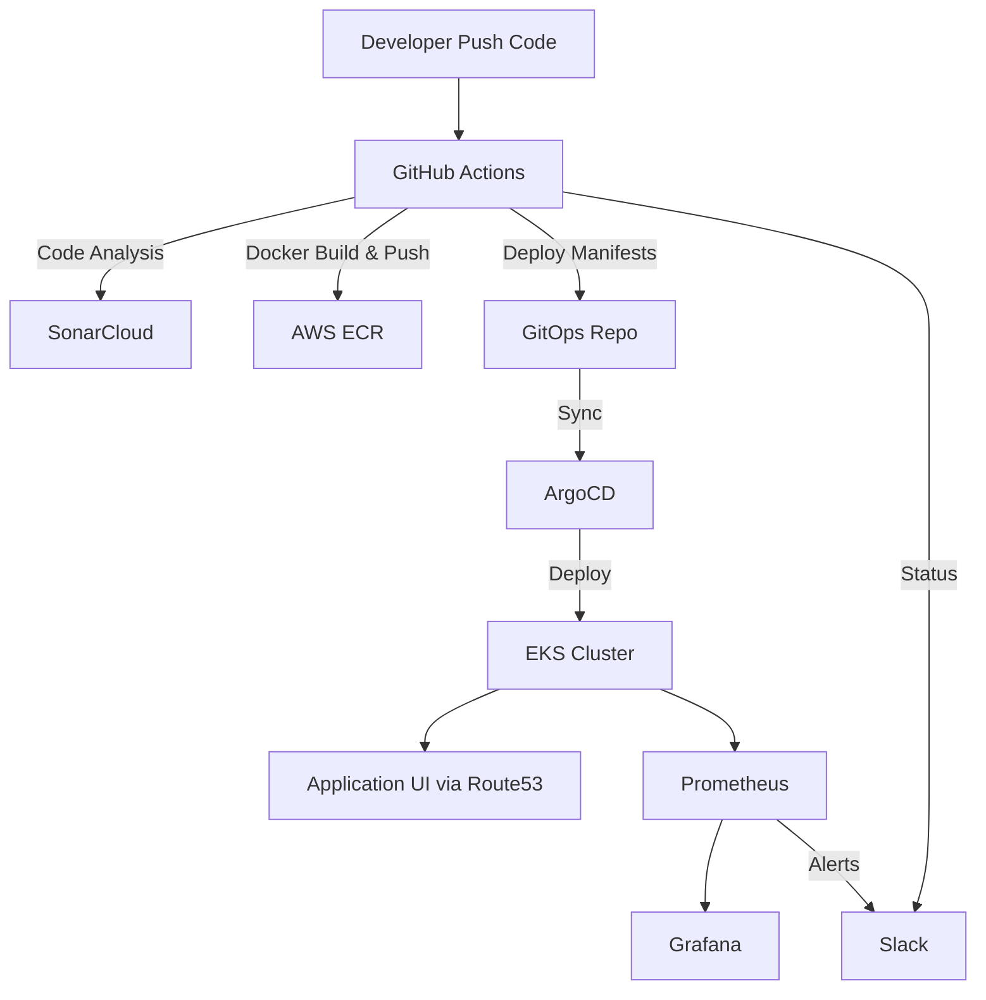

# Automated Deployment of a Cloud-Native Application on AWS with Terraform, GitHub Actions, ArgoCD, Prometheus, Grafana, and Slack

# Introduction

This repository contains all the necessary files and configurations to automate the deployment of a cloud-native application on **Amazon EKS** using **Terraform, Docker, GitHub Actions, ArgoCD, SonarCloud, Prometheus, Grafana, and Slack integration**.
The goal is to build a **scalable, secure, and production-ready pipeline** for infrastructure provisioning, application delivery, monitoring, and quality assurance.

---

# Project Directory Layout

* **terraform/**

  * `backend.tf`: Defines remote backend in S3 for Terraform state.
  * `eks-cluster.tf`: Provisions the EKS cluster and related AWS resources.
  * `variables.tf`: Stores input variables for the Terraform scripts.
  * `outputs.tf`: Defines Terraform outputs.
  * `main.tf`: Core IaC configuration.

* **k8s/**

  * `deployments/`: Kubernetes Deployment manifests for application components.
  * `services/`: Kubernetes Service definitions for networking.
  * `ingress/`: Ingress configurations with Route53 domain.
  * `secrets/`: Managed using ExternalSecrets and AWS Secrets Manager.

* **.github/workflows/**

  * `app-ci-cd.yml`: CI/CD pipeline for building, testing, scanning, and deploying the app.
  * `terraform-apply.yml`: Pipeline for provisioning infrastructure with Terraform.

* **ansible/**

  * `install-argocd.yaml`: Playbook to install and configure ArgoCD.
  * `install-kube-prometheus-stack.yaml`: Playbook to install Prometheus & Grafana.
  * `inventory.ini`: Ansible inventory file with target hosts.

* **monitoring/**

  * `alertmanager-config.yaml`: Alertmanager configuration for Slack alerts.
  * `clustersecretstore-aws.yaml`: External Secrets integration with AWS Secrets Manager.
  * `external-secrets-crds.yaml`: CustomResourceDefinitions for External Secrets.
  * `prometheus-role.yaml`: RBAC permissions for Prometheus.
  * `secret-slack-webhook.yaml`: Kubernetes secret containing Slack webhook URL.
  * `test-slack-alert.yaml`: Test configuration for validating Slack alerts.

* **docker/**

  * Dockerfiles for building application images.

* **docs/**

  * Screenshots, diagrams, and setup documentation.

---

# Dependencies

Ensure the following tools and accounts are available:

* AWS Account with IAM access
* Terraform
* Docker
* GitHub Actions (private/public repo)
* AWS ECR (Elastic Container Registry)
* Amazon S3 (for remote Terraform backend)
* Route53 (for DNS & domain)
* ArgoCD
* Prometheus & Grafana
* SonarCloud (with Sonar Scanner + Quality Gates)
* Slack Workspace with Webhooks

---

# Setup Guide

1. **Push Application Code to GitHub**
   Store the application source code and manifests in this repository.

2. **Create Dockerfiles**
   Define Dockerfiles for your app, build with GitHub Actions, and push to **AWS ECR**.

3. **Provision Infrastructure with Terraform**

   * Configure backend in `backend.tf` with **S3 bucket**.
   * Run:

     ```bash
     cd terraform
     terraform init
     terraform apply -auto-approve
     ```

4. **Configure GitHub Actions Pipelines**

   * **CI/CD Workflow (`app-ci-cd.yml`)**:

     * Run **Sonar Scanner** → push results to **SonarCloud**.
     * Apply **Sonar Quality Gate**.
     * Build & push Docker images to **ECR**.
     * Deploy manifests to GitOps repo.
     * Send build/deployment status to **Slack**.
   * **Terraform Workflow (`terraform-apply.yml`)**:

     * Provision AWS infrastructure.
     * Notify results to Slack.

5. **Deploy with ArgoCD**

   * Install ArgoCD using `ansible/install-argocd.yaml`.
   * Sync GitHub repo with EKS cluster.
   * Monitor deployment via **ArgoCD Dashboard**.

6. **Set Up Monitoring (Prometheus & Grafana)**

   * Install monitoring stack using `ansible/install-kube-prometheus-stack.yaml`.
   * Configure alerting with files under `monitoring/`.
   * Alerts will be sent directly to **Slack**.

---

# Dashboards

### ArgoCD Dashboard

Monitor application deployments and GitOps sync.


---

### Grafana Dashboard

View custom panels for application and cluster metrics.


---

### Prometheus Targets

Inspect metrics collection and alerting rules.


---

### SonarCloud Quality Gate

Ensure clean, secure, and maintainable code.


---

### Slack Notifications

Receive real-time updates for CI/CD pipelines and monitoring alerts.


---

# Architecture Overview



---

# Conclusion

By following this guide, you achieve:

* **Fully automated deployments** with GitHub Actions + ArgoCD.
* **Infrastructure as Code** with Terraform (state stored in S3).
* **Secure container images** stored in AWS ECR.
* **Code quality assurance** via SonarCloud.
* **Monitoring & observability** using Prometheus & Grafana.
* **Real-time notifications** via Slack.

This setup enables a **robust, scalable, and production-ready DevOps pipeline** for cloud-native applications on AWS.
