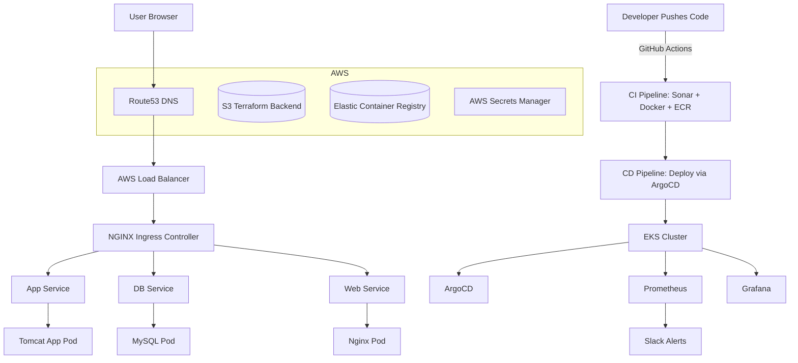

# Cloud-Native GitOps Project

This repository contains the infrastructure, CI/CD pipelines, monitoring stack, and GitOps workflows for deploying a microservices-based application on **AWS EKS** with complete observability, quality gates, and automated scaling.

The project leverages **Terraform, Ansible, ArgoCD, SonarCloud, Prometheus, Grafana, Slack, Route53, and AWS services (ECR, S3, Secrets Manager, Load Balancer, GitHub Secrets)**.

---

# 📌 Introduction

The goal of this project is to automate the provisioning, deployment, monitoring, and continuous delivery of a **profile application** using a **GitOps approach**.

Key components include:

* **Terraform** for Infrastructure as Code (EKS, VPC, Route53, S3, ECR).
* **GitHub Actions** for CI/CD with SonarCloud integration.
* **Docker & ECR** for containerized application delivery.
* **ArgoCD** for GitOps continuous deployment.
* **Prometheus & Grafana** for monitoring & observability.
* **Slack integration** for alerting.
* **GitHub Secrets & AWS Secrets Manager** for secure credentials management.

---

# 🖼️ Project Architecture



---

# 🖥️ ArgoCD Dashboard

ArgoCD ensures **GitOps continuous delivery** by syncing Kubernetes manifests from GitHub to the EKS cluster.
It provides visibility into application health, sync status, and deployment history.


---

# 🔍 Sonar (Scanner, Gate, Cloud)

Sonar integration ensures **code quality and security** before deployment:

* **Sonar Scanner** analyzes code for bugs, vulnerabilities, and code smells.
* **Sonar Gate** enforces quality thresholds before merging.
* **SonarCloud** provides a centralized dashboard for analysis results.


---

# 📊 Prometheus & Grafana

Prometheus collects **metrics from Kubernetes workloads and cluster resources**.
Grafana visualizes these metrics with custom dashboards.

Slack integration sends **alerts for anomalies** (e.g., pod crashes, resource exhaustion).


---

# 📱 Application

The deployed application runs inside the **EKS cluster** and is exposed through:

**User → Browser → Route53 → Load Balancer → Ingress → Services → Pods**

* **Route53** resolves the custom domain to the AWS Load Balancer.
* **Ingress (NGINX)** routes requests to backend services.
* **Services** forward traffic to Pods (App, DB, Web).

### How to Access

* Visit your **Route53 domain** in a browser:

  ```
  https://myprofile.com
  ```
* The request flows through Route53 → Load Balancer → Ingress → Services → Pods.


---

# 🐳 Dockerfiles

This project uses **official Docker base images** for security and reliability (Tomcat, MySQL, Nginx, OpenJDK).

### 🔹 Application (Tomcat + Java WAR)

```dockerfile
FROM openjdk:11 AS BUILD_IMAGE
RUN apt update && apt install maven -y
RUN git clone https://github.com/amrelabbasy11/CloudNativeGitOpsProfileService.git
RUN cd CloudNativeGitOpsProfileService && mvn install

FROM tomcat:9-jre11
RUN rm -rf /usr/local/tomcat/webapps/*
COPY --from=BUILD_IMAGE CloudNativeGitOpsProfileService/target/vprofile-v2.war /usr/local/tomcat/webapps/ROOT.war
EXPOSE 8080
CMD ["catalina.sh", "run"]
```

### 🔹 Database (MySQL)

```dockerfile
FROM mysql:8.0.33
LABEL "Project"="Vprofile"
LABEL "Author"="Amr Elabbasy"
ENV MYSQL_ROOT_PASSWORD="vprodbpass"
ENV MYSQL_DATABASE="accounts"
ADD db_backup.sql docker-entrypoint-initdb.d/db_backup.sql
```

### 🔹 Web (Nginx)

```dockerfile
FROM nginx
RUN rm -rf /etc/nginx/conf.d/default.conf
COPY nginvproapp.conf /etc/nginx/conf.d/vproapp.conf
```

---

# 🔐 Secrets Management

Sensitive values such as **AWS credentials, Docker/ECR authentication, Sonar tokens, and Slack webhook URLs** are never hardcoded. Instead, they are stored in:

* **GitHub Secrets** → Used inside GitHub Actions workflows (Terraform, Sonar, Docker/ECR).
* **AWS Secrets Manager** → Accessed through ExternalSecrets for Kubernetes workloads.

Example (GitHub Actions using GitHub Secrets):

```yaml
env:
  AWS_ACCESS_KEY_ID: ${{ secrets.AWS_ACCESS_KEY_ID }}
  AWS_SECRET_ACCESS_KEY: ${{ secrets.AWS_SECRET_ACCESS_KEY }}
  SONAR_TOKEN: ${{ secrets.SONAR_TOKEN }}
  DOCKER_USERNAME: ${{ secrets.DOCKER_USERNAME }}
  DOCKER_PASSWORD: ${{ secrets.DOCKER_PASSWORD }}
  SLACK_WEBHOOK: ${{ secrets.SLACK_WEBHOOK }}
```

---

# 📂 Repository Structure

```bash
├── terraform/                  # Infrastructure as Code
│   ├── backend.tf
│   ├── eks-cluster.tf
│   ├── main.tf
│   ├── outputs.tf
│   ├── terraform.tf
│   └── variables.tf
│
├── ansible/                    # Playbooks for installing tools
│   ├── install-argocd.yaml
│   ├── install-kube-prometheus-stack.yaml
│   └── inventory.ini
│
├── monitoring/                 # Monitoring configs & integrations
│   ├── alertmanager-config.yaml
│   ├── clustersecretstore-aws.yaml
│   ├── external-secrets-crds.yaml
│   ├── prometheus-role.yaml
│   ├── secret-slack-webhook.yaml
│   └── test-slack-alert.yaml
│
├── k8s/                        # Kubernetes manifests
│   ├── deployments/
│   ├── services/
│   ├── ingress/
│   ├── secrets/
│   └── configmaps/
│
├── docker/                     # Dockerfiles for App, DB, Web
│   ├── Dockerfile.app
│   ├── Dockerfile.db
│   └── Dockerfile.web
│
├── .github/workflows/          # GitHub Actions pipelines
│   ├── app-ci-cd.yaml
│   └── terraform-iac.yaml
│
└── README.md
```

---

# ⚙️ Workflows

### 🔹 Terraform IaC Workflow

* Provisions **VPC, Subnets, EKS Cluster, Route53, ECR, S3 Backend**.
* Uses **remote S3 backend** for state management.

### 🔹 Application CI/CD Workflow

1. **Code pushed to GitHub**.
2. **Sonar Scanner & Sonar Gate** validate code quality.
3. **Docker build & push** to AWS ECR.
4. **ArgoCD syncs manifests** to EKS for deployment.

### 🔹 Monitoring & Alerts

* Prometheus collects metrics.
* Grafana visualizes cluster health.
* Alertmanager sends **Slack alerts** on failures.

---

# 🔗 References

* [Terraform Registry](https://registry.terraform.io/)
* [Kubernetes Documentation](https://kubernetes.io/docs/)
* [Docker Documentation](https://docs.docker.com/)
* [SonarCloud Documentation](https://docs.sonarcloud.io/)
* [ArgoCD Documentation](https://argo-cd.readthedocs.io/)
* [Prometheus Documentation](https://prometheus.io/docs/)
* [Grafana Documentation](https://grafana.com/docs/)
* [Slack API Documentation](https://api.slack.com/)

---

# ✅ Conclusion

By following this setup, the application achieves:

* **Scalable infrastructure** via Terraform + EKS.
* **Automated CI/CD** with GitHub Actions, Docker, ECR, and ArgoCD.
* **Quality gates** enforced with SonarCloud.
* **Observability & alerts** via Prometheus, Grafana, and Slack.
* **Secure secrets management** with GitHub Secrets & AWS Secrets Manager.

This ensures a **secure, automated, and production-ready GitOps deployment pipeline**.
